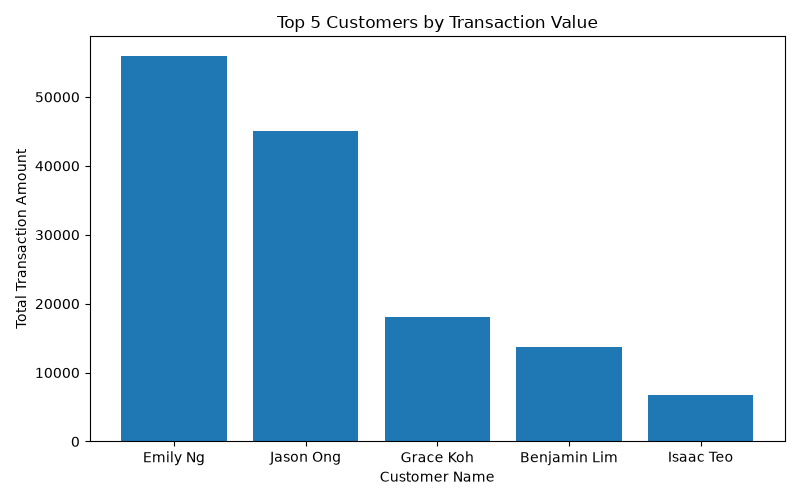
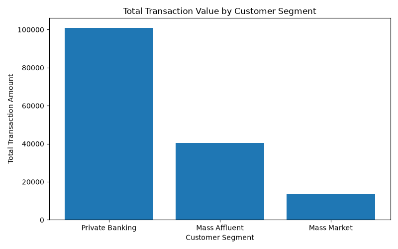
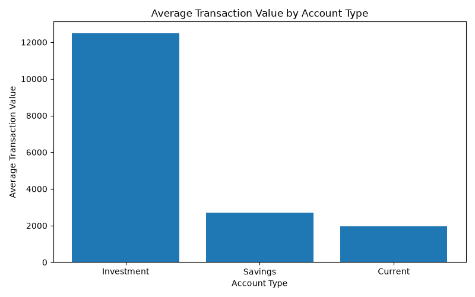

# Singapore Bank Analytics

A PostgreSQL and Python project using simulated banking data to practise SQL, relational database concepts and data analysis with pandas.

The database contains customer, account and transaction data. I used SQL and Python/pandas to analyse customer balances, transaction activity and account usage.

## Database Structure

The project uses three main tables:
- `customers`
- `accounts`
- `transactions`

The tables are linked as follows:

`customers` → `accounts` → `transactions`

## SQL Skills Used

- Creating tables
- Primary and foreign keys
- INNER JOIN
- GROUP BY
- SUM, AVG and COUNT
- HAVING
- ORDER BY
- LIMIT
- CASE WHEN
- Views

## Python / pandas Skills Used

- Loading CSV files with `read_csv()`
- DataFrames
- Filtering and selecting columns
- `groupby()`
- `sum()`, `mean()` and `count()`
- `agg()`
- `reset_index()`
- `sort_values()`
- `merge()`
- Analysing data across multiple datasets

## Analysis

Some of the questions explored in this project include:
- Which customers have the highest total account balances?
- Which customers own more than one account?
- Which customer segment has the highest transaction value?
- Which transaction categories have the highest transaction value?
- What is the average transaction amount by account type?
- Which accounts have the highest number of transactions?
- Who are the top 5 customers by total transaction value?
- Which customers have total transaction value above 5,000?
- What are the 10 largest individual transactions?

SQL and Python/pandas were used to analyse the same simulated banking dataset from different perspectives.

## Visualisations
I created three charts to summarise some of the main findings from the Python analysis:

### Top 5 Customers by Transaction Value

### Total Transaction Value by Customer Segment

### Average Transaction Value by Account Type

## Files

- `01_create_tables.sql` - creates the database tables
- `02_insert_data.sql` - inserts the sample data
- `03_create_view.sql` - creates a joined view for analysis
- `04_sql_analysis.sql` - contains the SQL analysis queries
- `05_python_analysis.py` - contains the Python/pandas analysis
- `06_visualisations.py` - creates the project visualisations
- `customers.csv` - customer data used in the Python analysis
- `accounts.csv` - account data used in the Python analysis
- `transactions.csv` - transaction data used in the Python analysis
- `charts/` - contains the saved visualisations

## Tools

- PostgreSQL
- pgAdmin
- SQL
- Python
- pandas
- Matplotlib
- VS Code
- GitHub

## Note

All data used in this project is simulated and does not represent real customers or transactions.
